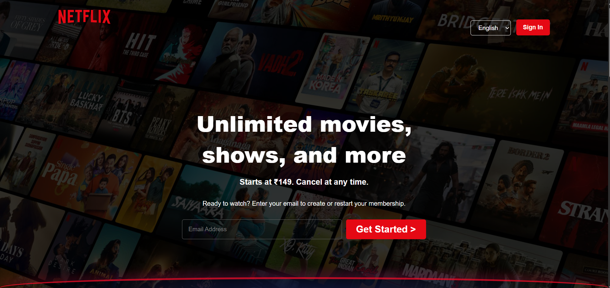

# 🎬 Netflix Clone (HTML & CSS)

A responsive Netflix landing page clone built using **HTML and CSS**.

## 🚀 Features

* 🔥 Modern Netflix-style UI
* 📱 Responsive design (desktop, tablet, mobile)
* 🎥 Trending movies section
* ❓ FAQ section
* 📧 Email input UI
* 🧾 Footer with multiple links

## 🛠️ Tech Stack

* HTML5
* CSS3 (Flexbox & Grid)

#### 📷 Preview



## 🎥 Demo Video

[▶ Watch Demo] https://github.com/user-attachments/assets/17eecabf-0073-48d1-ba62-44de87812cf8

## Preview

Recording 2026-04-15 094915.mp4

## 📌 Project Status

* ✅ Version 1: UI built using HTML & CSS
* 🔜 Version 2: Add interactivity using JavaScript (FAQ toggle, slider, etc.)

## 📂 Folder Structure

```
project/
│── index.html
│── style.css
│── Assets/
```

## 🎯 What I Learned

* Layout design using Flexbox & Grid
* Responsive web design
* UI cloning techniques
* Clean structuring of HTML & CSS

## 📬 Future Improvements

* Add FAQ dropdown using JavaScript
* Add carousel/slider for trending section
* Improve animations and transitions

---

💡 This project is part of my frontend development learning journey.
